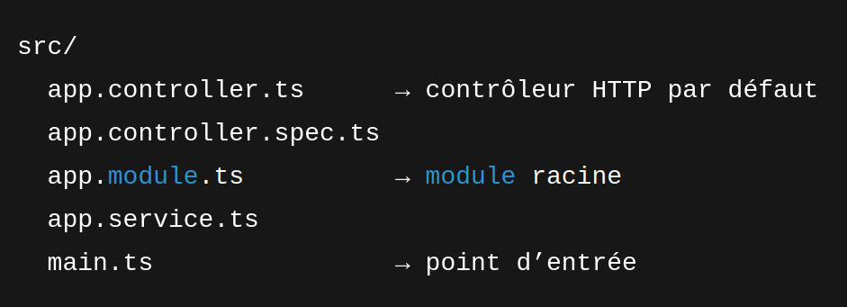
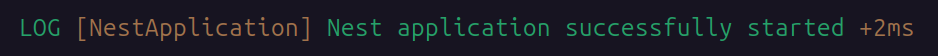

# web-temps-reel

## Getting started

```
git clone https://gitlab.com/esgi4255746/web-temps-reel.git
cd web-temps-reel
```
le depot constient une installation de base nestJS


```
npm i
docker compose up --build
```
Vous devez obtenir un terminal en watch mode :

l'application est disponible : http://localhost:3000/

## lancer le projet  

si vous n'avez pas encore nest :
```
npm install -g @nestjs/cli
```

### branche polling
```
git checkout feat/polling
docker compose up --build -d
docker logs -f realtime_app
```

### branche long polling
```
git checkout feat/long-polling
```
Pour tester les mises à jour :
http://localhost:3000/increment (depuis un autre onglet)

### branche Server Side Events
```
git checkout feat/sse
```


### branche WebSocket
```
git checkout feat/websocket
```
Installer les dépendances :  
```
npm install @nestjs/websockets @nestjs/platform-socket.io
npm install ioredis
```
